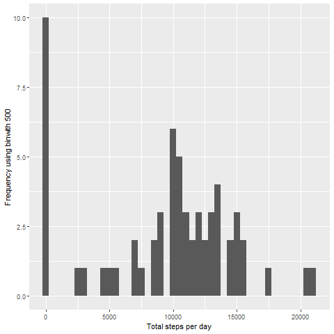
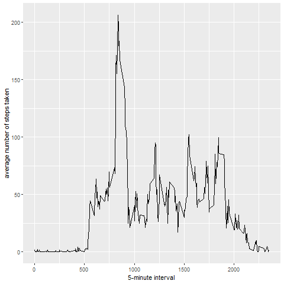
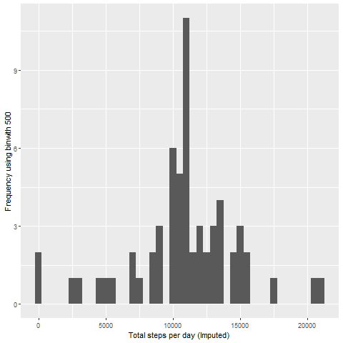
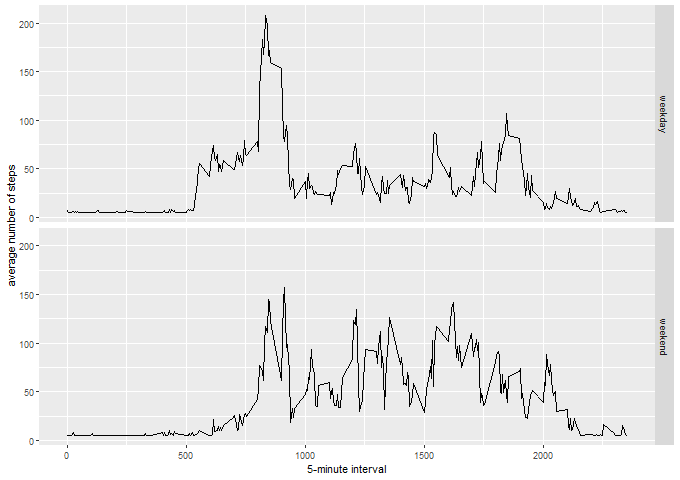

## Load and process the data


```r
activityData <- read.csv('activity.csv')
#activityData$interval <- strptime(gsub("([0-9]{1,2})([0-9]{2})", "\\1:\\2", activityData$interval), format='%H:%M')
```


-----

## Mean total number of steps taken per day.


```r
stepsDay <- tapply(activityData$steps, activityData$date, sum, na.rm=TRUE)
```

##### 1. Histogram of the total number of steps taken each day


```r
qplot(stepsDay, xlab='Total steps per day', ylab='Frequency using binwith 500', binwidth=500)
```




##### 2. Mean and median total number of steps taken per day


```r
stepsDayMean <- mean(stepsDay)
stepsDayMedian <- median(stepsDay)
```
* Mean: 9354.2295082 
* Median: 10395

-----

## Average daily activity pattern?


```r
avgStepsPerTimeBlock <- aggregate(x=list(meanSteps=activityData$steps), by=list(interval=activityData$interval), FUN=mean, na.rm=TRUE)
```

##### 1. Time series plot


```r
ggplot(data=avgStepsPerTimeBlock, aes(x=interval, y=meanSteps)) +
    geom_line() +
    xlab("5-minute interval") +
    ylab("average number of steps taken") 
```


##### 2. The 5-minute interval on average across all the days in the dataset that contains the maximum number of steps?


```r
maxSteps <- which.max(avgStepsPerTimeBlock$meanSteps)
timeMaxSteps <-  gsub("([0-9]{1,2})([0-9]{2})", "\\1:\\2", avgStepsPerTimeBlock[maxSteps,'interval'])
```

* Most Steps at: 8:35

----

## Missing values
##### 1. The total number of missing values in the dataset 


```r
MissingValues <- length(which(is.na(activityData$steps)))
```

* Number of missing values: 2304

##### 2. Devise a strategy for filling in all of the missing values in the dataset.
##### 3. Create a new dataset that is equal to the original dataset but with the missing data filled in.


```r
activityDataImputed <- activityData
activityDataImputed$steps <- impute(activityData$steps, fun=mean)
```


##### 4. Histogram of the total number of steps taken each day 


```r
stepsDayImputed <- tapply(activityDataImputed$steps, activityDataImputed$date, sum)
qplot(stepsDayImputed, xlab='Total steps per day (Imputed)', ylab='Frequency using binwith 500', binwidth=500)
```




 

##### ... and Calculate and report the mean and median total number of steps taken per day. 


```r
stepsDayMeanImputed <- mean(stepsDayImputed)
stepsDayMedianImputed <- median(stepsDayImputed)
```
* Mean (Imputed): 1.0766189 &times; 10<sup>4</sup>
* Median (Imputed):  1.0766189 &times; 10<sup>4</sup>


----

## Are there differences in activity patterns between weekdays and weekends?
##### 1. Create a new factor variable in the dataset with two levels ??? ???weekday??? and ???weekend??? indicating whether a given date is a weekday or weekend day.


```r
activityDataImputed$dateType <-  ifelse(as.POSIXlt(activityDataImputed$date)$wday %in% c(0,6), 'weekend', 'weekday')
```

##### 2. Panel plot containing a time series plot


```r
avgActivityDataImputed <- aggregate(steps ~ interval + dateType, data=activityDataImputed, mean)
ggplot(avgActivityDataImputed, aes(interval, steps)) + 
    geom_line() + 
    facet_grid(dateType ~ .) +
    xlab("5-minute interval") + 
    ylab("average number of steps")
```


